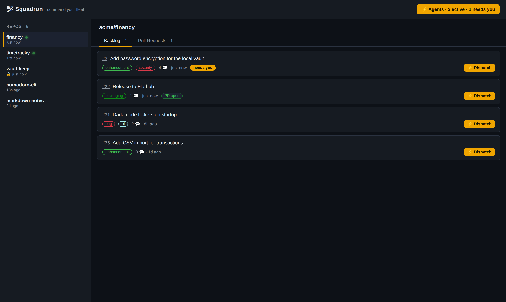
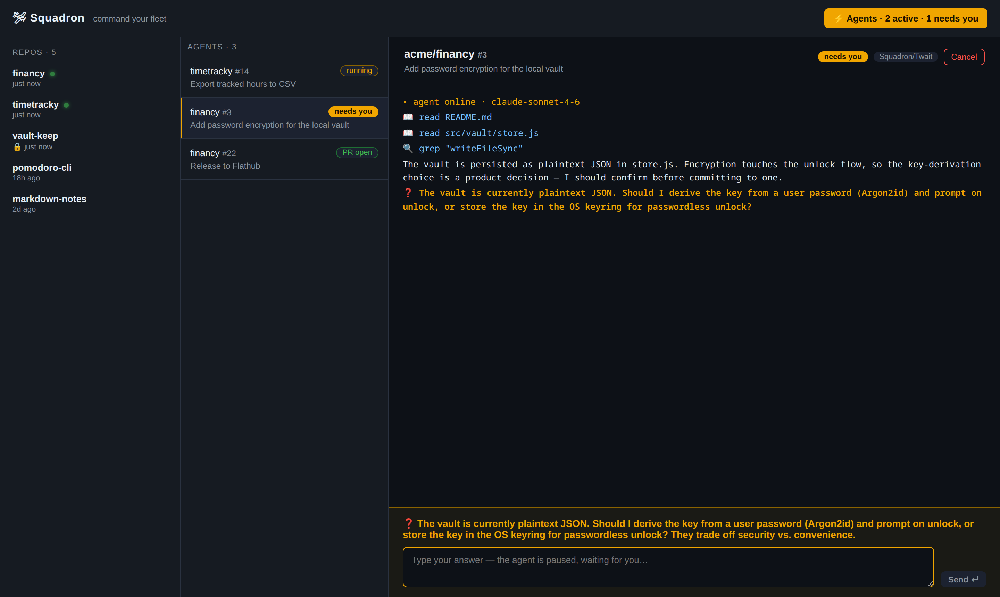

# 🛩 Squadron

**A local cockpit for commanding Claude agents across your fleet of GitHub repos.**

Stop the context-switch grind — opening a project, opening Claude, re-explaining what
to do, babysitting the change, pushing the PR. Squadron puts every repo on one screen:
browse the backlog, dispatch an autonomous agent at an issue, watch it work live, and
get a pull request back. One operator, many projects.

> ⚠️ Demo data below. The screenshots use a fictional `acme/*` fleet via demo mode
> (`?demo`) — your real repos never leave your machine.

## The cockpit

All your repos in one place, each with its open issues and PRs. Hit **⚡ Dispatch** on
any issue to send an agent at it.



## Agents work live — and ask when it matters

Every dispatched agent streams its work (reads, edits, commands) into the Agents panel.
Agents stay autonomous by default, but when a wrong assumption would be expensive or
irreversible they **pause and ask you** — the run blocks until you answer, then resumes
exactly where it left off.



## What it does

- **Manage the backlog** — open issues across every repo, in one view
- **Fix issues → PR** — dispatch an agent at an issue; it works in an isolated git
  worktree, then opens a pull request
- **Watch agents live** — streamed reads / edits / commands, per agent, in parallel
- **Stay in the loop** — agents call `ask_user` when they need a decision; you answer
  inline and they continue
- **Cancel** any run mid-flight

## How it works

```
┌─────────────────────────────────────────────┐
│  web/  — Vite + React cockpit (the UI)       │
└───────────────┬─────────────────────────────┘
                │  HTTP + SSE (live stream)
┌───────────────▼─────────────────────────────┐
│  server/ — Node + Express                    │
│   • Claude Agent SDK (headless agents)       │
│   • git worktree per task (safe parallelism) │
│   • GitHub via the `gh` CLI                  │
└──────────────────────────────────────────────┘
```

- **Isolation:** every task runs on its own branch in its own git worktree, so multiple
  agents never collide — even on the same repo.
- **Auth:** agents use your existing Claude Code login; GitHub flows through `gh`. No
  tokens to manage.
- **Desktop-ready:** the backend is structured to drop into an Electron main process
  later; today it runs as a local web app.

## Requirements

- Node 18+ (developed on 24)
- [`gh`](https://cli.github.com/) — authenticated (`gh auth status`)
- A working Claude Code login on the machine

## Run

```bash
npm run setup   # install root + web deps
npm run dev     # backend on :5174, cockpit on :5173
```

Open **http://localhost:5173**. To preview with demo data (no real repos touched):
**http://localhost:5173/?demo**

## Status

| Slice | Feature | State |
|------:|---------|:-----:|
| 1 | Cockpit — repos, backlog, PRs | ✅ |
| 2 | Dispatch agent — issue → worktree → live stream → PR | ✅ |
| 3 | Interactive `ask_user` — pause for clarification, resume on answer | ✅ |
| 4 | PR review — AI review over a diff, post comments | ⏳ |
| 5 | Parallel agents panel + run history | ⏳ |

## License

MIT
