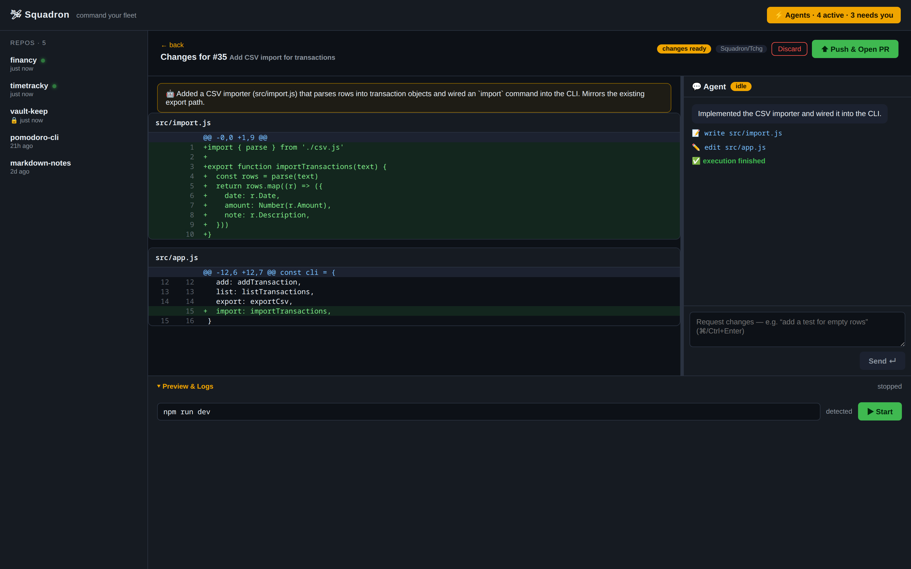
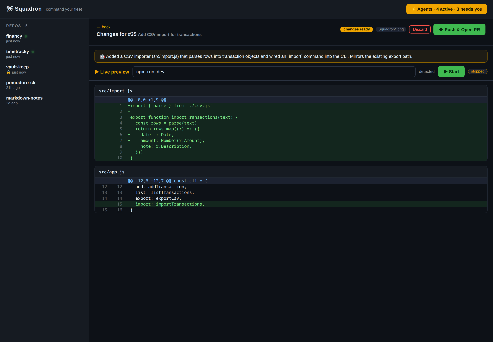
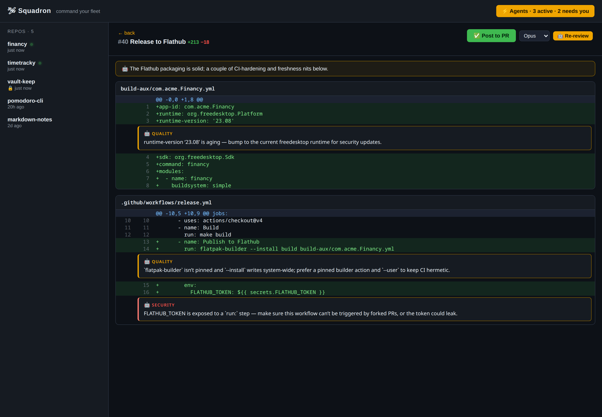
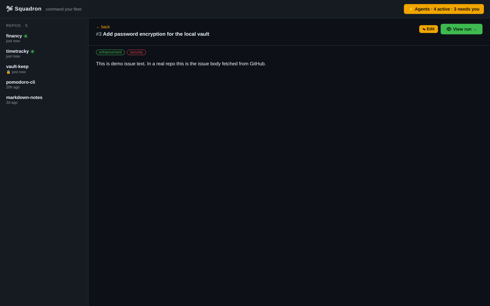
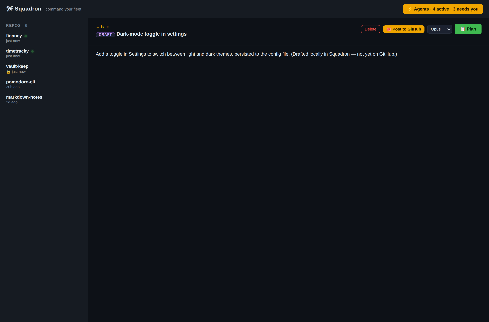

<p align="center">
  
</p>

<h1 align="center">🛩 Squadron</h1>

**A local cockpit for commanding Claude agents across your fleet of GitHub repos.**

Stop the context-switch grind — opening a project, opening Claude, re-explaining what
to do, babysitting the change, pushing the PR. Squadron puts every repo on one screen:
browse the backlog, dispatch an autonomous agent at an issue, watch it work live, and
get a pull request back. One operator, many projects.

> 🚧 **Experimental — run it in a VM.** Squadron is an experimental project and runs
> Claude agents with **bypassed permissions** (`bypassPermissions`) during autonomous
> execution — agents read, write, and run commands **without per-action approval**. The
> only guardrail is a `PreToolUse` guard that confines each agent to its git worktree (see
> [How it works](#how-it-works)). That confinement is best-effort, not a security sandbox.
> **Run Squadron inside a virtual machine or other isolated environment** so an agent can't
> touch anything you care about. Use at your own risk.

> ⚠️ Demo data below. The screenshots use a fictional `acme/*` fleet via demo mode
> (`?demo`) — your real repos never leave your machine.

## The core idea: one work loop, isolated by git worktrees

Every task in Squadron runs the same loop, and **nothing reaches GitHub until you say so**.
The principle is simple: each task gets **its own branch in its own git worktree**, so the
agent works against an isolated copy of the repo — never your real checkout — and many
agents can run in parallel, even on the same repo, without colliding.

```
   ┌──────────┐   ┌──────────┐   ┌─────────────────────┐   ┌──────────┐   ┌──────────────┐   ┌──────────┐
   │  ISSUE   │──▶│   PLAN   │──▶│  WORKTREE + EXECUTE  │──▶│  REVIEW  │──▶│  PUSH & PR   │──▶│ AI REVIEW│
   │ (backlog)│   │read-only │   │ isolated branch,     │   │ diff +   │   │ open / update│   │ inline   │
   │ or draft │   │ + refine │   │ autonomous, local    │   │ iterate  │   │ the PR       │   │ findings │
   └──────────┘   └────┬─────┘   │ commits, no push     │   └────┬─────┘   └──────────────┘   └──────────┘
                       │         └─────────────────────┘        │
                  you approve                              you push / discard /
                  the plan                                 request more changes
```

- **Plan** — a read-only agent investigates and proposes a plan; you refine it in chat.
- **Worktree + execute** — once approved, an autonomous agent edits code and commits
  **locally inside its own git worktree** (under `~/.squadron`, outside your projects).
- **Review** — the diff lands in **Ready to Review**; you read it, iterate, or discard.
- **Push & PR** — only on your click does the branch push and the PR open (or update).

Not every task needs the full loop — fire a **Quick task** (errand) to skip planning, or
let an agent **review** or **fix** an existing PR. All of them run in an isolated worktree.

## The cockpit

All your repos in one place, each with its open issues and PRs. Hit **⚡ Dispatch** on
any issue to send an agent at it. A live usage gauge in the sidebar shows your remaining
Claude headroom before you commit a run.


## Plan first, then execute

You don't fire an agent blind, and nothing reaches GitHub without you. Clicking
**📋 Plan** starts a **read-only** planning session: the agent investigates the code and
proposes a concrete plan, and you refine it in a chat ("use Argon2id, not the keyring").
Nothing is written yet. When you're happy, hit **✅ Approve & Dispatch** — the approved
plan drives an autonomous execution run that edits the code and **commits it locally in an
isolated worktree, without pushing**. Because execution continues in the same warm session
the planner used, the agent already knows the codebase by the time it starts writing.


The result lands in **Ready to Review** as local changes. You open it, read the full diff
of what the agent did, and then either **⬆ Push & Open PR**, **discard**, or **💬 request
more changes** — the agent re-runs in the same worktree, revises, and you re-review (it can
pause to ask you mid-revision). So the flow is **plan → approve → review → (iterate) →
push** — nothing leaves your machine until you say so.

Ready to Review is a **mini-IDE**: the diff is the editor, a resizable **Agent chat** on
the right drives revisions (always-on input, interrupt anytime), and a collapsible
**Preview & Logs** dock sits at the bottom.



This front-loads the one part where you add the most value — direction and scope — and
keeps execution (where agents are reliable) autonomous. During execution, an agent can
still **pause and ask you** via `ask_user` when a wrong assumption would be expensive,
resuming where it left off once you answer.

## Live preview before you push

From any Ready-to-Review change, **▶ Start** runs that worktree's dev command and streams
the logs. Squadron **auto-detects** the command (npm `dev`/`start`/`serve`, Go, Cargo,
Make, Python — or set your own per repo, or commit a `.squadron.json`). If it serves a web
URL it's embedded in an iframe; otherwise the process just runs (a desktop window opens on
your machine). You verify the change actually works *before* it becomes a PR.



## Review PRs inline

Click any PR to see its diff in-app. **🤖 AI Review** runs a read-only agent over the
diff (PR checked out for context) and renders its findings as **inline comment cards
anchored to the exact lines** — severity-coded (bug / security / quality) — then post the
whole review to GitHub with one click. Squadron also rolls up the PR's **CI checks** into a
single pass/fail/pending badge and can dispatch an agent to **fix failing CI** or
**resolve merge conflicts**, with the fix landing in Ready to Review to update the PR.



## Draft the backlog, with or without GitHub

Create issues right in Squadron. **Save locally** to keep a draft inside Squadron (never
posted to GitHub) or **post to GitHub** to make it a real issue — and promote a local draft
to GitHub later. Local drafts sit in the backlog alongside real issues, editable anytime.

<p align="center">
  
  
</p>

Open any backlog item to read its full detail — labels, body, and a jump straight to its
agent run.

## What it does

- **Manage the backlog** — open issues across every repo, in one view; open any item to
  read its full detail and jump to its run
- **Draft backlog items** — create issues right in Squadron and either **save locally**
  (kept in Squadron, not on GitHub) or **create on GitHub**; promote a local draft later
- **Plan → approve → review → PR** — scope an issue interactively, approve, and an
  autonomous agent implements it locally in an isolated worktree; you review the diff in
  **Ready to Review** and push to open the PR when it's right
- **Quick tasks (errands)** — skip the plan: tell a docked agent to do something small,
  chat with it as it works, and its changes land in Ready to Review like any other run
- **Live preview before push** — from a Ready-to-Review change, **▶ Start** runs that
  worktree's dev command (auto-detected: npm / go / cargo / make / python, or set your own)
  and streams logs; web URLs embed in an iframe, other processes just run
- **Review PRs inline** — click a PR to see the diff in-app; **🤖 AI Review** renders the
  agent's findings as inline comment cards anchored to the exact lines, then post to GitHub
- **CI at a glance + auto-fix** — every PR shows a rolled-up CI status with a per-check
  breakdown; dispatch an agent to fix failing CI or resolve merge conflicts
- **Watch agents live** — streamed reads / edits / commands, per agent, in parallel,
  with a live "working…" indicator so a quiet think never looks like a hang
- **Stay in the loop** — refine the plan in chat; agents call `ask_user` mid-execution
  when they need a decision
- **Pick the firepower** — Opus / Sonnet / Haiku per task
- **Watch your headroom** — a live gauge of your Claude subscription usage (5-hour and
  weekly windows) sits in the sidebar
- **Desktop notifications** — get OS toasts when a run is ready to review, needs your
  input, fails, or opens a PR
- **Curate your fleet** — pick the repos you actually work on; add more from a searchable
  picker
- **Cancel** any run mid-flight

## How it works

```
┌─────────────────────────────────────────────┐
│  web/  — Vite + React cockpit (the UI)       │
└───────────────┬─────────────────────────────┘
                │  HTTP + SSE (live stream)
┌───────────────▼─────────────────────────────┐
│  server/ — Node + Express                    │
│   • Claude Agent SDK (headless agents)       │
│   • git worktree per task (safe parallelism) │
│   • GitHub via the `gh` CLI                  │
└──────────────────────────────────────────────┘
```

- **Isolation:** every task runs on its own branch in its own git worktree (seeded from a
  per-repo mirror clone under `~/.squadron`, outside your projects), so multiple agents
  never collide — even on the same repo. A `PreToolUse` guard **confines each agent to its
  worktree**: any attempt to read, write, or `cd` outside it is blocked, even during
  autonomous execution. Autonomous runs use Claude's `bypassPermissions` mode (no
  per-action approval), so this guard is the only thing standing between an agent and the
  rest of your machine — **run Squadron in a VM** (see the warning at the top).
- **Auth:** agents use your existing Claude Code login; GitHub flows through `gh`. No
  tokens to manage. The usage gauge reads the same Claude credentials read-only.
- **Desktop-ready:** ships as an Electron desktop app with auto-update, and also runs as a
  local web app for development.

## Requirements

- Node 18+ (developed on 24)
- [`gh`](https://cli.github.com/) — authenticated (`gh auth status`)
- A working Claude Code login on the machine

## Install (desktop app)

Grab the latest **`.rpm`** from [Releases](https://github.com/RaihanStark/squadron/releases) and install it:

```bash
sudo dnf install ./Squadron-0.2.0.x86_64.rpm   # Fedora/RHEL
# or: sudo rpm -i ./Squadron-*.rpm
```

Then launch **Squadron** from your app menu. It still needs `gh` (authenticated) and a
Claude Code login on the machine. Releases are built from source by GitHub Actions.

## Run from source (dev)

```bash
npm run setup   # install root + web deps
npm run dev     # backend on :5174, cockpit on :5173
npm run electron  # or run it as the desktop app (after `npm run build:web`)
```

Open **http://localhost:5173**. To preview with demo data (no real repos touched):
**http://localhost:5173/?demo**

## Status

| Slice | Feature | State |
|------:|---------|:-----:|
| 1 | Cockpit — repos, backlog, PRs | ✅ |
| 2 | Execute — issue → worktree → live stream → PR | ✅ |
| 3 | Interactive `ask_user` — pause for clarification, resume on answer | ✅ |
| 4 | Per-task model picker (Opus / Sonnet / Haiku) | ✅ |
| 5 | Plan first — interactive read-only plan → Approve & Dispatch → execute | ✅ |
| 6 | PR review — read-only AI review of a diff → approve → post comment | ✅ |
| 7 | In-app diff viewer + inline AI review findings | ✅ |
| 8 | Review-before-push — agent commits locally → review diff → push to PR | ✅ |
| 9 | Create backlog items (local draft or GitHub) + issue detail view | ✅ |
| 10 | Live preview — run a Ready-to-Review worktree (web iframe / desktop / logs) | ✅ |
| 11 | Quick tasks (errands) — plan-less docked agent → Ready to Review | ✅ |
| 12 | CI status rollup + agent-driven CI fix / conflict resolution | ✅ |
| 13 | Usage gauge + desktop notifications | ✅ |
| 14 | Parallel agents panel + run history | ⏳ |

## License

MIT
